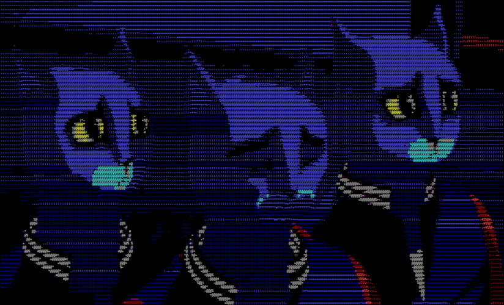

# text-graphics
turn images or YouTube videos into console art
default width is 315, height 80, which can be changed towards the top of the script

## Requirements
* pytube `(py -m pip install pytube)`
* numba `(py -m pip install numba)`
* opencv-python (cv2) `(py -m pip install opencv-python)`
## Usage
`python process_image.py image.jpg`
`python process_image.py animated.gif`
`python process_image.py https://www.youtube.com/watch?v=_X6VoFBCE9k`
